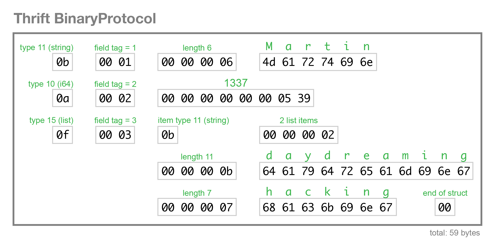
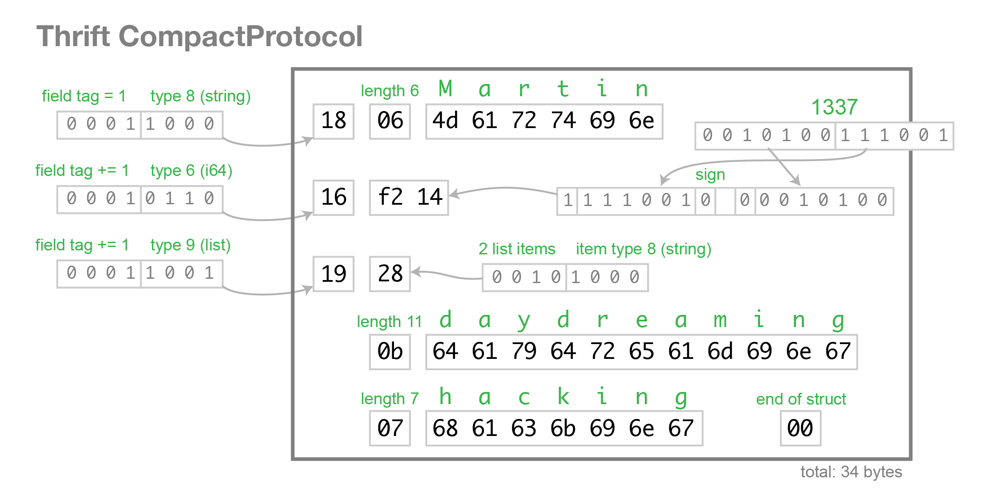

RPC(Remote Procedure Call)
---------------

## RPC 是什么？
Remote Procedure Call:
```
In distributed computing, a remote procedure call (RPC) is when a computer program causes a procedure (subroutine) to execute in another address space (commonly on another computer on a shared network), which is coded as if it were a normal (local) procedure call, without the programmer explicitly coding the details for the remote interaction.
@Wiki
```
比如说，你的程序调用了一个函数，一般来说这个函数是在你这个程序本身定义和实现的。可是现在，这个函数的定义和实现却在另一个进程或者另一台电脑上，表面上你是直接对函数进行了调用，实际上调用时通过了进程间通信或者网络通信的。这种就叫做RPC。

RPC属于一种request/response协议，就是客户端发起一个请求，服务器端返回一个响应。其本身可以定义一些通信格式等，比如说JSON, XML, 或者binary等。

再来一个stackoverflow上的回答：
```
An RPC framework in general is a set of tools that enable the programmer to call a piece of code in a remote process, be it on a different machine or just another process on the same machine.
@ [stackoverflow](http://stackoverflow.com/questions/20653240/what-is-rpc-framework-and-apache-thrift)
```

## Thrift
先来看看官方定义：
```
Thrift is a software library and set of code-generation tools devel- oped at Facebook to expedite development and implementation of efficient and scalable backend services.
@《Thrift: Scalable Cross-Language Services Implementation》
```
Thrift是一个软件库(software library)以及一个代码生成工具的集合。由facebook提出，用来加速开发高效率和可扩展的后端服务(service)。
它解决的是什么问题呢？
在facebook，有很多个后端的service，然后每个service可能使用的开发语言并不一样。Service之间需要进行通信，于是就需要定义一套通信的传输标准，走网络的话，传输协议基本就是TCP或者HTTP了，而数据包里面的数据格式，则需要另一套标准。Thrift就提供了这一套标准，其传输的数据格式也可以进行选择，可以是JSON或者Binary。定义好标准之后，然后每个语言都需要实现一些代码来进行传输，这一部分，从功能上讲是重复的，而且可以单独提取出来。于是Thrift就提供了一个工具，可以针对不同的语言生成用于传输数据的代码。比如，你用java，那么用Thrift就可以生成java语言编写的发起Request和接收Response的代码，生成之后，业务代码就可以直接调用了。

Thrift可以实现RPC，怎么个实现法呢？Remote Procedure Call，这里的Procedure就是指一段代码，在编程里面，一段代码抽象一下，就是一个函数。Remote Procedure Call在某种程度上，可以称为Remote Method Call。既然是函数，自然有函数三件套：函数名，返回值，参数。实现RPC，自然要实现对函数的定义。而Thrift通过定义一个.thrift文件格式，实现了这种约束。通过后面的例子，可以略见一斑。

## Apache Thrift
#### 同样先来看看官方定义：
```
The Apache Thrift software framework, for scalable cross-language services development, combines a software stack with a code generation engine to build services that work efficiently and seamlessly between C++, Java, Python, PHP, Ruby, Erlang, Perl, Haskell, C#, Cocoa, JavaScript, Node.js, Smalltalk, OCaml and Delphi and other languages.
@ [Apache Thrift](https://thrift.apache.org/)
```
其实跟上面的Thrift差不多，也是一个库(software stack)和一个代码生成工具。为什么呢？因为这个东西本来是facebook先搞出来的，后面贡献给了Apache，所以两个其实差不多咯。

##### 那么怎么使用呢？
大概步骤有三步：
* 写一个.thrift文件，定义方法
* 使用thrift工具产生代码
* 引入thrift library
* 编写客户端和服务器端代码

接下来用一个例子来解释：
首先定义一个.thrift文件service.thrift:
```c
/*
 * Licensed to the Apache Software Foundation (ASF) under one
 * or more contributor license agreements. See the NOTICE file
 * distributed with this work for additional information
 * regarding copyright ownership. The ASF licenses this file
 * to you under the Apache License, Version 2.0 (the
 * "License"); you may not use this file except in compliance
 * with the License. You may obtain a copy of the License at
 *
 *   http://www.apache.org/licenses/LICENSE-2.0
 *
 * Unless required by applicable law or agreed to in writing,
 * software distributed under the License is distributed on an
 * "AS IS" BASIS, WITHOUT WARRANTIES OR CONDITIONS OF ANY
 * KIND, either express or implied. See the License for the
 * specific language governing permissions and limitations
 * under the License.
 */

# Thrift Tutorial
# Mark Slee (mcslee@facebook.com)
#
# This file aims to teach you how to use Thrift, in a .thrift file. Neato. The
# first thing to notice is that .thrift files support standard shell comments.
# This lets you make your thrift file executable and include your Thrift build
# step on the top line. And you can place comments like this anywhere you like.
#
# Before running this file, you will need to have installed the thrift compiler
# into /usr/local/bin.

/**
 * The first thing to know about are types. The available types in Thrift are:
 *
 *  bool        Boolean, one byte
 *  i8 (byte)   Signed 8-bit integer
 *  i16         Signed 16-bit integer
 *  i32         Signed 32-bit integer
 *  i64         Signed 64-bit integer
 *  double      64-bit floating point value
 *  string      String
 *  binary      Blob (byte array)
 *  map<t1,t2>  Map from one type to another
 *  list<t1>    Ordered list of one type
 *  set<t1>     Set of unique elements of one type
 *
 * Did you also notice that Thrift supports C style comments?
 */

// Just in case you were wondering... yes. We support simple C comments too.

/**
 * Thrift files can reference other Thrift files to include common struct
 * and service definitions. These are found using the current path, or by
 * searching relative to any paths specified with the -I compiler flag.
 *
 * Included objects are accessed using the name of the .thrift file as a
 * prefix. i.e. shared.SharedObject
 */
include "shared.thrift"

/**
 * Thrift files can namespace, package, or prefix their output in various
 * target languages.
 */
namespace cpp tutorial
namespace d tutorial
namespace dart tutorial
namespace java tutorial
namespace php tutorial
namespace perl tutorial
namespace haxe tutorial

/**
 * Thrift lets you do typedefs to get pretty names for your types. Standard
 * C style here.
 */
typedef i32 MyInteger

/**
 * Thrift also lets you define constants for use across languages. Complex
 * types and structs are specified using JSON notation.
 */
const i32 INT32CONSTANT = 9853
const map<string,string> MAPCONSTANT = {'hello':'world', 'goodnight':'moon'}

/**
 * You can define enums, which are just 32 bit integers. Values are optional
 * and start at 1 if not supplied, C style again.
 */
enum Operation {
  ADD = 1,
  SUBTRACT = 2,
  MULTIPLY = 3,
  DIVIDE = 4
}

/**
 * Structs are the basic complex data structures. They are comprised of fields
 * which each have an integer identifier, a type, a symbolic name, and an
 * optional default value.
 *
 * Fields can be declared "optional", which ensures they will not be included
 * in the serialized output if they aren't set.  Note that this requires some
 * manual management in some languages.
 */
struct Work {
  1: i32 num1 = 0,
  2: i32 num2,
  3: Operation op,
  4: optional string comment,
}

/**
 * Structs can also be exceptions, if they are nasty.
 */
exception InvalidOperation {
  1: i32 whatOp,
  2: string why
}

/**
 * Ahh, now onto the cool part, defining a service. Services just need a name
 * and can optionally inherit from another service using the extends keyword.
 */
service Calculator extends shared.SharedService {

  /**
   * A method definition looks like C code. It has a return type, arguments,
   * and optionally a list of exceptions that it may throw. Note that argument
   * lists and exception lists are specified using the exact same syntax as
   * field lists in struct or exception definitions.
   */

   void ping(),

   i32 add(1:i32 num1, 2:i32 num2),

   i32 calculate(1:i32 logid, 2:Work w) throws (1:InvalidOperation ouch),

   /**
    * This method has a oneway modifier. That means the client only makes
    * a request and does not listen for any response at all. Oneway methods
    * must be void.
    */
   oneway void zip()

}

/**
 * That just about covers the basics. Take a look in the test/ folder for more
 * detailed examples. After you run this file, your generated code shows up
 * in folders with names gen-<language>. The generated code isn't too scary
 * to look at. It even has pretty indentation.
 */
```

然后定义另一个share.thrift:
```c
/*
 * Licensed to the Apache Software Foundation (ASF) under one
 * or more contributor license agreements. See the NOTICE file
 * distributed with this work for additional information
 * regarding copyright ownership. The ASF licenses this file
 * to you under the Apache License, Version 2.0 (the
 * "License"); you may not use this file except in compliance
 * with the License. You may obtain a copy of the License at
 *
 *   http://www.apache.org/licenses/LICENSE-2.0
 *
 * Unless required by applicable law or agreed to in writing,
 * software distributed under the License is distributed on an
 * "AS IS" BASIS, WITHOUT WARRANTIES OR CONDITIONS OF ANY
 * KIND, either express or implied. See the License for the
 * specific language governing permissions and limitations
 * under the License.
 */

/**
 * This Thrift file can be included by other Thrift files that want to share
 * these definitions.
 */

namespace cpp shared
namespace d share // "shared" would collide with the eponymous D keyword.
namespace dart shared
namespace java shared
namespace perl shared
namespace php shared
namespace haxe shared

struct SharedStruct {
  1: i32 key
  2: string value
}

service SharedService {
  SharedStruct getStruct(1: i32 key)
}

```

然后使用命令生成java代码：
```
thrift -r --gen java service.thrift
```

这会生成两个文件件：shared和tutorial。之后建立一个gradle工程，将shared和tutorial拷贝到`src/main/java`下面。
添加依赖，即在build.gradle里面的`dependencies`部分加上thrift的依赖：
```
dependencies {
    compile('org.apache.thrift:libthrift:0.9.3')
    testCompile group: 'junit', name: 'junit', version: '4.11'
}
```

然后添加一个package，这里是`li.koly`。然后添加client和server：
```
package li.koly;

import org.apache.thrift.TException;
import org.apache.thrift.protocol.TBinaryProtocol;
import org.apache.thrift.protocol.TProtocol;
import org.apache.thrift.transport.TSocket;
import org.apache.thrift.transport.TTransport;
import shared.SharedStruct;
import tutorial.Calculator;
import tutorial.InvalidOperation;
import tutorial.Operation;
import tutorial.Work;

public class JavaClient {
    public static void main(String[] args) {

        try {
            TTransport transport;
            transport = new TSocket("localhost", 9090);
            transport.open();
            // 数据以二进制的形式传输
            TProtocol protocol = new TBinaryProtocol(transport);
            Calculator.Client client = new Calculator.Client(protocol);

            perform(client);

            transport.close();
        } catch (TException x) {
            x.printStackTrace();
        }
    }

    private static void perform(Calculator.Client client) throws TException {
        client.ping();
        System.out.println("ping()");

        // Calculator.Client 实现了Calculator.Iface，所以可以调用add方法
        int sum = client.add(1, 1);
        System.out.println("1+1=" + sum);

        Work work = new Work();

        work.op = Operation.DIVIDE;
        work.num1 = 1;
        work.num2 = 0;
        try {
            int quotient = client.calculate(1, work);
            System.out.println("Whoa we can divide by 0");
        } catch (InvalidOperation io) {
            System.out.println("Invalid operation: " + io.why);
        }

        work.op = Operation.SUBTRACT;
        work.num1 = 15;
        work.num2 = 10;
        try {
            int diff = client.calculate(1, work);
            System.out.println("15-10=" + diff);
        } catch (InvalidOperation io) {
            System.out.println("Invalid operation: " + io.why);
        }

        SharedStruct log = client.getStruct(1);
        System.out.println("Check log: " + log.value);
    }
}
```
这个是client，其中有注释。
下面是server。
```
package li.koly;

import org.apache.thrift.server.TServer;
import org.apache.thrift.server.TServer.Args;
import org.apache.thrift.server.TSimpleServer;
import org.apache.thrift.server.TThreadPoolServer;
import org.apache.thrift.transport.TSSLTransportFactory;
import org.apache.thrift.transport.TServerSocket;
import org.apache.thrift.transport.TServerTransport;
import org.apache.thrift.transport.TSSLTransportFactory.TSSLTransportParameters;

// Generated code
import tutorial.*;
import shared.*;

import java.util.HashMap;

public class JavaServer {

    public static CalculatorHandler handler;

    public static Calculator.Processor processor;

    public static void main(String [] args) {
        try {
            handler = new CalculatorHandler();
            processor = new Calculator.Processor(handler);

            Runnable simple = new Runnable() {
                public void run() {
                    simple(processor);
                }
            };
            
            new Thread(simple).start();
        } catch (Exception x) {
            x.printStackTrace();
        }
    }

    public static void simple(Calculator.Processor processor) {
        try {
            TServerTransport serverTransport = new TServerSocket(9090);
            TServer server = new TSimpleServer(new Args(serverTransport).processor(processor));

            // Use this for a multithreaded server
            // TServer server = new TThreadPoolServer(new TThreadPoolServer.Args(serverTransport).processor(processor));

            System.out.println("Starting the simple server...");
            server.serve();
        } catch (Exception e) {
            e.printStackTrace();
        }
    }

}
```

然后是具体的Calculator实现，也就是具体的业务实现了。
```

package li.koly;

import tutorial.*;
import shared.*;

import java.util.HashMap;

// Calculator.Iface定义了在service.thrift文件中定义的那些方法
public class CalculatorHandler implements Calculator.Iface {

    private HashMap<Integer,SharedStruct> log;

    public CalculatorHandler() {
        log = new HashMap<Integer, SharedStruct>();
    }

    public void ping() {
        System.out.println("ping()");
    }

    public int add(int n1, int n2) {
        System.out.println("add(" + n1 + "," + n2 + ")");
        return n1 + n2;
    }

    public int calculate(int logid, Work work) throws InvalidOperation {
        System.out.println("calculate(" + logid + ", {" + work.op + "," + work.num1 + "," + work.num2 + "})");
        int val = 0;
        switch (work.op) {
            case ADD:
                val = work.num1 + work.num2;
                break;
            case SUBTRACT:
                val = work.num1 - work.num2;
                break;
            case MULTIPLY:
                val = work.num1 * work.num2;
                break;
            case DIVIDE:
                if (work.num2 == 0) {
                    InvalidOperation io = new InvalidOperation();
                    io.whatOp = work.op.getValue();
                    io.why = "Cannot divide by 0";
                    throw io;
                }
                val = work.num1 / work.num2;
                break;
            default:
                InvalidOperation io = new InvalidOperation();
                io.whatOp = work.op.getValue();
                io.why = "Unknown operation";
                throw io;
        }

        SharedStruct entry = new SharedStruct();
        entry.key = logid;
        entry.value = Integer.toString(val);
        log.put(logid, entry);

        return val;
    }

    public SharedStruct getStruct(int key) {
        System.out.println("getStruct(" + key + ")");
        return log.get(key);
    }

    public void zip() {
        System.out.println("zip()");
    }

}
```
首先启动server，然后启动client，就可以看到输出了。需要注意的是在client的perform函数里面，直接调用`add`函数，就跟调用本地函数的感觉一样，但是实际上是调用的另一个process的函数，这就是所谓的RPC了。


#### 版本演进怎么处理？
为什么需要版本演进呢？比如说有一天你希望增加或者修改一个service，但是同时又需要支持旧的service，这个时候怎么处理呢？
根据[Thrift: Scalable Cross-Language Services Implementation](https://thrift.apache.org/static/files/thrift-20070401.pdf)，有四种情况：
* Added field，old client，new
  server。增加了东西（或者增加新的方法，或者增加了新的方法参数）。server是新的，客户端是老的。这时候客户端call的还是老的未增加的方法。此时，新的server应当能够对老方法进行支持。比如增加了方法，旧方法没有改动，可以直接调用旧方法。增加了方法参数，这时候就看server的逻辑，如果新增的参数是optional的，那么可以返回结果。如果不是，则可以返回错误信息。
* Added field，new client, old server。新客户端调用了新方法，此时会往server发送一个请求，但是旧server不认这个新方法，所以直接忽略掉。新方法增加参数，也是直接忽略掉。
* Removed field, old client, new server。跟上面的类似，旧客户端调用已经移除的方法，server直接忽略。
* Removed field, new client, old server。删除旧方法，客户端只能调用原有其他方法，此时server可以直接处理。但是如果是删除参数，那么server可能不知道如何处理参数缺失的状况。

当然了，如果碰到实在无法适应的变化，可以通过比如java中的package名字来做区分，比如li.koly.calculator.v1，li.koly.calculator.v2等。

## 相比Restful，为什么使用RPC能得到更好的performance?
Restful是基于Http协议的规范，其使用http method来对资源进行操作。而Thrift既可以使用HTTP，也可以使用TCP。使用TCP，就可以比HTTP减少一些消耗，比如HTTP需要定义一个相对冗长的Header，而单纯使用TCP则可能会避免。
上面是在协议层面减小的开销。在数据传输形式上，Thrift可以选择json，也可以选择Binary及compact binary。而Restful只能使用json。在网络上传输的时候，json最终会被翻译成二进制进行传输。使用json，就必须转换一些无用的格式信息，比如括号，引号等。这些信息会导致最终传输的信息量变大。比如：
```json
{
  "userName": "Martin",
  "favouriteNumber": 1337,
  "interests": [
    "daydreaming",
    "hacking"
  ]
}
```
假设一个字符占用8个bit，也就是一个byte。移除所有的空格，则需要82个bytes来对这段json进行传输。而如果使用Thrift的Binary编码方式，则只需要59个bytes。如果用Thrift的Compact Binary方式，则只需要34bytes。传输所需要的开销小了，表示同样的信息，其传输时间自然也就短了。具体过程见参考资料[5]。

Thrift的IDL（Interface Definition Language):
```
struct Person {
  1: string       userName,
  2: optional i64 favouriteNumber,
  3: list<string> interests
}
```

Bianry编码：


Compact Binary编码：


## Thrift的优点和缺点
我觉着

优点有：
* 传输优势，既可以选择HTTP，也可以选择TCP
* 格式优势，可以选择诸如Binary，CompactBinary之类的格式
* 不同语言的代码自动生成

缺点么：
* 支持不够广泛，比如如果是跟浏览器通信的话，只能选择json。当然这也限定了Thrift的应用条件——用于后端services之间的通信
* 文档，基本没有非常好的文档。

## 现在有哪些公司在使用Thrift?
根据[Quora](https://www.quora.com/Who-uses-Apache-Thrift-in-production)上的答案，有这些公司：
* Evernote
* Quora
* Facebook
* Pinterest

最后，顺便贴一下参考资料[9]中提到的使用JSON的场景：
* You need or want data to be human readable
* Data from the service is directly consumed by a web browser
* Your server side application is written in JavaScript
* You aren’t prepared to tie the data model to a schema
* You don’t have the bandwidth to add another tool to your arsenal
* The operational burden of running a different kind of network service is too great

总的来说，Thrift是一个比较好的RPC框架，适用于后端service之间的通信。在选择Binary格式的时候，可以在带宽有限的情况下传输更多数据，同时也更快。其提供的代码生成工具能够生成不同语言的Thrift通信代码。

参考资料：

[1] [Remote procedure call](https://en.wikipedia.org/wiki/Remote_procedure_call) 
[2] [Apache Thrift](https://thrift.apache.org/) 
[3] [What is rpc framework and apache thrift](http://stackoverflow.com/questions/20653240/what-is-rpc-framework-and-apache-thrift) 
[4] [Apache thrift concepts](https://thrift.apache.org/docs/concepts) 
[5] [Schema evolution in Avro, Protocol Buffers and Thrift](http://martin.kleppmann.com/2012/12/05/schema-evolution-in-avro-protocol-buffers-thrift.html) 
[6] [Thrift missing guide](https://diwakergupta.github.io/thrift-missing-guide) 
[7] [Thrift tutorial](http://thrift-tutorial.readthedocs.org/en/latest/thrift-stack.html) 
[8] [Thrift: Scalable Cross-Language Services Implementation](https://thrift.apache.org/static/files/thrift-20070401.pdf) 
[9] [Choose protocal buffers](http://blog.codeclimate.com/blog/2014/06/05/choose-protocol-buffers/) 

